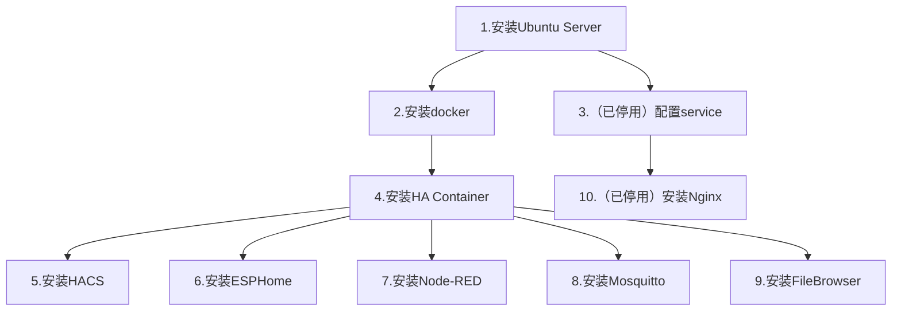

# 树莓派 + Ubuntu Server + HA Container 安装指南

# _警告：本方案在内网能完美运行，但内网穿透后在外网使用较为困难，困难点在于ESPHome只允许在局域网访问或使用https访问，而https意味着你除了要有公网IP外还要有域名。_

b站视频链接[https://www.bilibili.com/video/BV1G6gQzVEgF/?share_source=copy_web&vd_source=d17175c986cec83b4c79184b625c9ea2](https://www.bilibili.com/video/BV1G6gQzVEgF/?share_source=copy_web&vd_source=d17175c986cec83b4c79184b625c9ea2)  
权威性优先级：官网内容>我的文字内容>我的视频内容

1. [安装Ubuntu Server](./安装Ubuntu_Server.md)
2. [安装docker](./安装docker.md)
3. [配置service](./配置service.md)
4. [安装HA Container](./安装HA_Container.md)
5. [安装HACS](./安装HACS.md)
6. [安装ESPHome](./安装ESPHome.md)
7. [安装Node-RED](./安装Node-RED.md)
8. [安装Mosquitto](./安装Mosquitto.md)
9. [安装FileBrowser](./安装FileBrowser.md)
10. [安装Nginx](./安装Nginx.md)