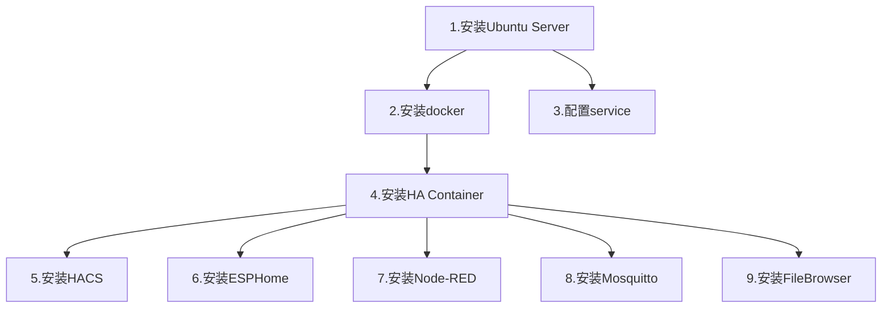

# 树莓派 + Ubuntu Server + HA Container 安装指南

1. [安装Ubuntu Server](./安装Ubuntu_Server.md)
2. [安装docker](./安装docker.md)
3. [配置service](./配置service.md)
4. [安装HA Container](./安装HA_Container.md)
5. [安装HACS](./安装HACS.md)
6. [安装ESPHome](./安装ESPHome.md)
7. [安装Node-RED](./安装Node-RED.md)
8. [安装Mosquitto](./安装Mosquitto.md)
9. [安装FileBrowser](./安装FileBrowser.md)