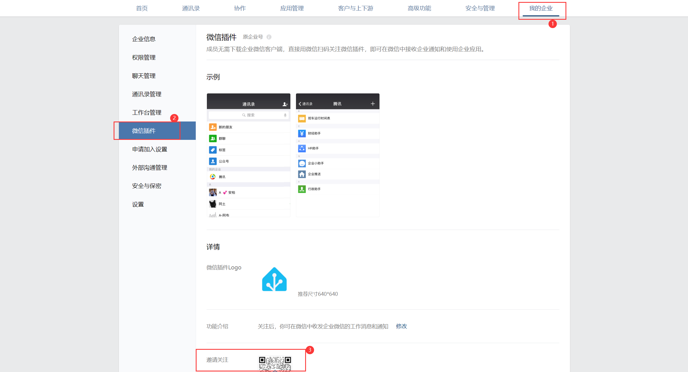
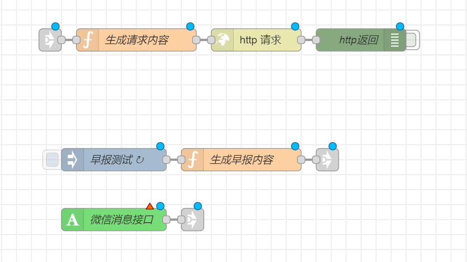

# 企业微信群机器人消息推送（推荐）  
**完全不需要公网IP！！**  
b站链接[https://www.bilibili.com/video/BV1REHxeGEug/](https://www.bilibili.com/video/BV1REHxeGEug/)

## 目录
  * [创建群聊及机器人](#创建群聊及机器人-)
  * [导入流](#导入流-)
  * [增加其他类型消息的支持（留作课后习题）](#增加其他类型消息的支持留作课后习题)

  
## 创建群聊及机器人  
1. 因为要建立企业微信群，所以需要找一个垫背的提前跟人家沟通好，别引发什么误会（建好群之后就可以踢掉）。但是如果确需拉别人进群，则需要让目标用户在企业微信PC端“我的企业”->“微信插件”->“邀请关注”处扫码，如下图
    
2. 在企业微信APP消息界面点击右上角“+”，选择发起群聊，拉垫背的入群
3. 在群聊天界面点击右上角三个点进入设置，选择群机器人，进入机器人界面后点击右上角添加按钮
4. 点击右上角“新建”新建一个机器人，随意输入一个名字，点击添加，会弹出webhook地址，保存下来
## 导入流  
1. 导入流[企业微信群机器人消息推送Node-RED流.json](企业微信群机器人消息推送Node-RED流.json)，刚导入后效果如下
    
2. 修复Server错误
    * 双击“微信消息接口”，编辑实体配置，修改Server为您的Home Assistant
3. 填充机器人webhook链接
    * 双击“生成请求内容”function，将msg.url内容替换为自己的webhook链接
4. 部署即可
    * 可以点击“早报测试”进行消息测试
    * 亦或者在Home Assistant左侧概览页面找到文本类下的wxText输入任意内容进行测试
## 增加其他类型消息的支持（留作课后习题）
[官方文档](https://developer.work.weixin.qq.com/document/path/91770?notreplace=true)