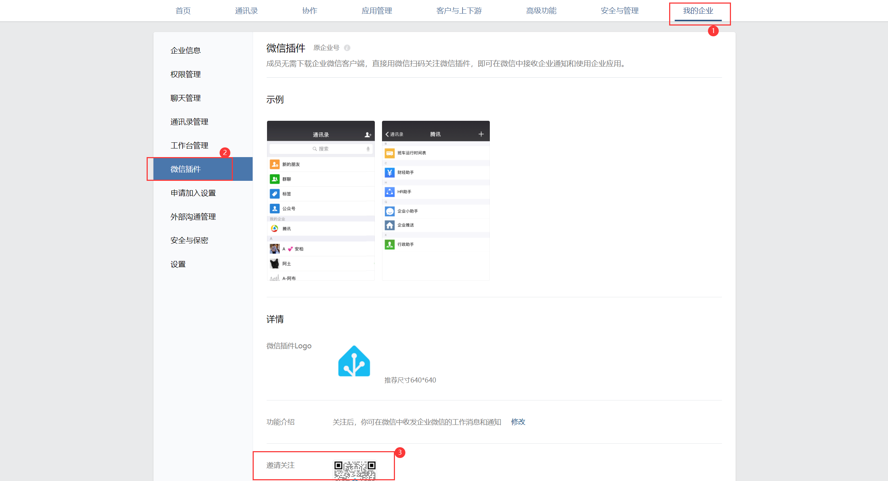
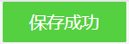

# wxMsg
**注意：需要一下公网ip（用来通过企业微信可信IP认证，只使用一下）**  
**本项目代码部署部分以部署在云服务器上进行演示**
  
## 目录
  * [企业微信接收消息服务器设置](#企业微信接收消息服务器设置)
  * [Node-RED微信推送能力流设置](#Node-RED微信推送能力流设置)
  
## 创建应用  
1. 进入企业微信后，进入“应用管理”界面，点击自建部分的“创建应用”  
    
2. 根据创建应用界面的要求填写相关信息，可见范围部分一定要有**部门**
3. 进入“我的企业”界面，点击“微信插件”，微信扫码“邀请关注”处的二维码以接受消息推送  
    
  
## 企业微信接收消息服务器设置
1. 将[code](code)文件夹上传至有公网ip的服务器，**_并进入code文件夹内_**  
    文件夹中的[WXWXBizMsgCrypt3.py](code/WXBizMsgCrypt3.py)与[ierror.py](code/ierror.py)均来自于github项目[weworkapi_python](https://github.com/sbzhu/weworkapi_python/tree/master/callback)
2. 安装gunicorn等，注意此时工作目录在第1步上传的文件夹内（[gunicorn参考教程1](https://www.cnblogs.com/Mystogan/p/16144753.html)）（[gunicorn参考教程2](https://www.cnblogs.com/Ray-liang/p/4837850.html)）
    * 安装virtualenv  
        `sudo pip install virtualenv`
    * 创建虚拟环境  
        `virtualenv venv`
    * 进入虚拟环境  
        `source venv/bin/activate`
    * 安装所需的包，有gunicorn、flask、pycryptodome  
        `(venv) pip3 install -r requirements.py`  
3. 测试服务是否正常可用（可跳过）  
    * 运行test.py  
        `python3 test.py`
    * 虚拟环境内启动gunicorn  
        `(venv) gunicorn -w 1 -b 0.0.0.0:8080 test:app`  
        其中8080是你要从外网访问的端口，可以自己设，与flask使用的端口无关，**_记得在服务器安全组中开放_**。test是文件名，app是test文件内的实例名。
    * 浏览器访问服务器ip:8080，如果能看到页面显示“Hello World!”说明成功
    * ctrl+c结束本步骤中启动的gunicorn
    * ctrl+c结束本步骤中启动的test.py
4. 认证接收消息服务器  
    * 进入企业微信->应用管理->自建应用->企业可信IP->接收消息服务器配置界面  
          
    * 随机获取Token与EncodingAESKey  
        将生成的Token填入[wxRes.py](code/wxRes.py)的sToken变量  
        将生成的EncodingAESKey填入[wxRes.py](code/wxRes.py)的sEncodingAESKey变量  
        将企业ID（在企业微信“我的企业”tab最底下）填入[wxRes.py](code/wxRes.py)的sCorpID变量
    * 运行[wxRes.py](code/wxRes.py)  
        `python3 wxRes.py`  
    * 虚拟环境内启动gunicorn  
        `(venv) gunicorn -w 1 -b 0.0.0.0:8080 wxRes:app`  
    * 将http://\<ip\>:8080填入接收消息服务器配置界面的URL处，点击保存，顺利的话会弹出“保存成功”字样  
          
    * ctrl+c结束本步骤中启动的gunicorn  
    * 退出虚拟环境  
        `(venv) deactivate`  
    * ctrl+c结束本步骤中启动的test.py  
    * 关闭云服务器开放的8080端口  
5. 在企业可信IP界面添加Home Assistant公网出口IP（如果不知道可以先不填，后续步骤可以获取该信息）
  
## Node-RED微信推送能力流设置
1. 导入流[flows_new.json](flows_new.json)，导入后界面如下图
    
2. 修复Server错误
    * 双击“早报测试”，修改Server为您的Home Assistant
    * 双击“向HA发送需新增IP通知”，修改Server为您的Home Assistant
    * 双击“微信文字消息”，编辑实体配置，修改Server为您的Home Assistant
    * **进行部署**
3. 修复实体缺失
    * 双击“早报测试”，修改实体为“微信文字消息”对应的实体（没有自定义的话我设置的名称为wxText）
4. 填充企业微信信息
    * 双击“判断当前ip是否变化出授权范围”，点击“初始化函数”，将“和自建应用企业可信IP处填的一样”替换为企业可信IP处填写的内容，双引号不要删
    * 双击“获取access_token”，将URL地址中的“公司ID”、“自建程序secret”替换为实际值
    * 双击“生成请求”，根据注释将“toparty”与“agentid”字段修改为实际值
    * **进行部署**
5. 测试  
    点击“注入”，如果可信IP信息过时，那么Home Assistant界面会有一条需要更新IP的通知，需要将通知里的“所有IP”内容复制到**企业可信IP 与 “判断当前ip是否变化出授权范围”的初始化函数的原IP信息处**。  
    如果Home Assistant未弹IP过时，那么微信应该可以收到消息了，没收到的话可以打开“http返回”进行debug。